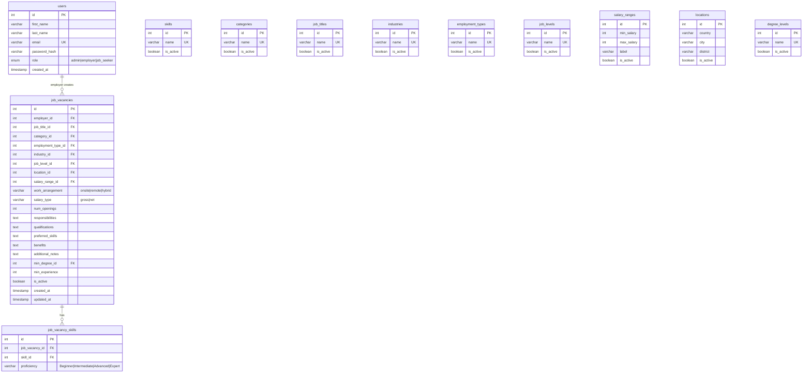

# Backend Integration Report v2
## Job Portal — Frontend ↔ Backend Readiness Audit (Post-Fix)

**Date:** April 15, 2026  
**Version:** 2.0 — All frontend gaps resolved  
**Status:** Frontend **100% Complete** → Ready for Backend Integration

---

## 1. Project Architecture Assessment

### Your Proposed Structure

```
|---Models/          (Data logic: jobVacancy.php, role.php, ...)
|---Controllers/     (Logic core)
|---Views/           (PHP webpages — current HTML → .php)
|---Public/          (HTML/CSS/JS, index.php entry point)
|---Config/          (DB connection)
```

### ✅ Verdict: GOOD — Standard MVC

Recommended expanded version with all necessary files:

```
project-root/
│
├── Public/                        ← Web root (Apache DocumentRoot)
│   ├── index.php                  ← Front controller / router
│   ├── style.css                  ← ✅ Built
│   ├── script.js                  ← ✅ Built
│   └── assets/                    ← Images, fonts
│
├── Config/
│   ├── database.php               ← PDO connection (host, dbname, user, pass)
│   └── config.php                 ← App constants (BASE_URL, etc.)
│
├── Models/
│   ├── User.php                   ← Register, login, role check
│   ├── JobVacancy.php             ← CRUD for job postings
│   ├── JobSkill.php               ← Many-to-many: jobs ↔ skills
│   ├── Category.php               ← Reference table CRUD
│   ├── Skill.php                  ← Reference table CRUD
│   ├── Location.php               ← Reference table CRUD (country/city/district)
│   ├── Industry.php               ← Reference table CRUD
│   ├── EmploymentType.php         ← Reference table CRUD
│   ├── JobLevel.php               ← Reference table CRUD
│   ├── JobTitle.php               ← Reference table CRUD
│   └── SalaryRange.php            ← Reference table CRUD
│
├── Controllers/
│   ├── AuthController.php         ← Login, register, logout, session
│   ├── JobController.php          ← Employer CRUD, seeker search/filter/view
│   ├── AdminController.php        ← Manage postings + all 8 ref tables
│   └── PageController.php         ← Static pages (home, about, contact)
│
├── Views/
│   ├── layouts/
│   │   ├── header.php             ← Navbar (dynamic based on $_SESSION['role'])
│   │   └── footer.php             ← Footer (shared across all pages)
│   ├── home/
│   │   └── index.php              ← ✅ From index.html
│   ├── jobs/
│   │   ├── list.php               ← ✅ From jobs.html
│   │   └── detail.php             ← ✅ From job-details.html
│   ├── auth/
│   │   ├── login.php              ← ✅ From login.html
│   │   └── register.php           ← ✅ From register.html
│   ├── employer/
│   │   ├── dashboard.php          ← ✅ From employer-dashboard.html
│   │   └── job-form.php           ← ✅ From employer-job-form.html
│   ├── admin/
│   │   ├── dashboard.php          ← ✅ From admin-dashboard.html
│   │   └── references.php         ← ✅ From admin-references.html
│   ├── pages/
│   │   ├── about.php              ← ✅ From about.html
│   │   └── contact.php            ← ✅ From contact.html
│   └── partials/
│       ├── job-card.php            ← Reusable card component
│       └── pagination.php          ← Reusable pagination
│
└── Helpers/
    ├── session.php                 ← session_start(), auth guards
    └── validation.php              ← Server-side validation functions
```

---

## 2. Frontend → Backend Form Mapping

### All forms are mapped with `action` and `method` attributes:

| #   | Form                | File                     | `action`     | `method` | POST Fields                                                                         |
|-----|---------------------|--------------------------|--------------|----------|-------------------------------------------------------------------------------------|
| 1   | **Login**           | `login.html`             | `submit.php` | POST     | `email`, `password`, `remember`                                                     |
| 2   | **Register**        | `register.html`          | `submit.php` | POST     | `role`, `first_name`, `last_name`, `email`, `password`, `confirm_password`, `terms` |
| 3   | **Job Create/Edit** | `employer-job-form.html` | `submit.php` | POST     | `job_id` (hidden), `job_title`, `job_category`, `employment_type`, `industry`, `job_level`, `num_openings`, `country`, `city`, `district`, `work_arrangement`, `salary_range`, `salary_type`, `benefits`, `responsibilities`, `qualifications`, `preferred_skills`, `additional_notes`, `min_degree`, `min_experience`, `skills[N][name]`, `skills[N][proficiency]` |
| 4   | **Contact**         | `contact.html`           | `submit.php` | POST     | `first_name`, `last_name`, `email`, `message`                                       |
| 5   | **Job Detail Msg**  | `job-details.html`       | `submit.php` | POST     | `full_name`, `email`, `phone`, `message`                                            |
| 6   | **Newsletter**      | All pages (footer)       | `submit.php` | POST     | `email`                                                                             |
| 7   | **Admin Add Entry** | `admin-references.html`  | `submit.php` | POST     | `entry_name`, `entry_status`                                                        |

> [!NOTE]
> All forms currently point to `submit.php`. When migrating to MVC, update each form `action` to its respective controller route (e.g., `action="index.php?c=auth&a=login"`).

---

## 3. Requirement Compliance Matrix

### 3.1 Employer Features

| Requirement           | Frontend Ready?         | Backend TODO                                                                    | Priority |
|-----------------------|:-----------------------:|---------------------------------------------------------------------------------|:--------:|
| Create job postings   | ✅ Full form (A-F)      | `JobController::create()` — INSERT into `job_vacancies` + `job_vacancy_skills`  | 🔴       |
| Edit job postings     | ✅ Hidden `job_id` field | `JobController::edit($id)` — populate form, UPDATE on submit                    | 🔴       |
| Delete job postings   | ✅ Delete btn + confirm  | `JobController::delete($id)` — DELETE with confirm                              | 🔴       |
| Activate/deactivate   | ✅ Toggle status btn    | `JobController::toggleStatus($id)` — UPDATE `is_active`                         | 🔴       |
| View own job list     | ✅ Dashboard table      | `JobController::myJobs()` — SELECT WHERE `employer_id = $_SESSION['user_id']`   | 🔴       |

### 3.2 Job Seeker Features

| Requirement                    | Frontend Ready?        | Backend TODO                                                                     | Priority |
|--------------------------------|:----------------------:|----------------------------------------------------------------------------------|:--------:|
| Keyword search (title, desc)   | ✅ Sidebar text input  | `WHERE title LIKE ? OR description LIKE ?`                                       | 🔴       |
| Job category filter            | ✅ Checkboxes ×8       | `AND category_id IN (...)`                                                       | 🔴       |
| Location filter (country/city) | ✅ Select dropdown     | `AND location_id = ?`                                                            | 🔴       |
| Required skills filter         | ✅ Tags cloud          | `AND jv.id IN (SELECT job_id FROM job_vacancy_skills WHERE skill_id IN (...))`   | 🟡       |
| Employment type filter         | ✅ Checkboxes ×5       | `AND employment_type_id IN (...)`                                                | 🔴       |
| Job level filter               | ✅ Checkboxes ×3       | `AND job_level_id IN (...)`                                                      | 🔴       |
| Salary range filter            | ✅ Range slider        | `AND salary_min >= ? AND salary_max <= ?`                                        | 🔴       |
| Work arrangement filter        | ✅ Checkboxes ×3       | `AND work_arrangement IN (...)`                                                  | 🔴       |
| AND logic for filters          | ✅ Design supports it  | Combine all active filters with `AND` in SQL query                               | 🔴       |
| Sort: latest                   | ✅ Sort dropdown       | `ORDER BY created_at DESC`                                                       | 🔴       |
| Sort: salary asc/desc          | ✅ Sort dropdown       | `ORDER BY salary_min ASC/DESC`                                                   | 🔴       |
| Sort: title alphabetical       | ✅ Sort dropdown       | `ORDER BY title ASC/DESC`                                                        | 🔴       |
| Job detail view                | ✅ Complete page       | `JobController::show($id)` — SELECT with JOINs                                  | 🔴       |

### 3.3 Admin Features

| Requirement                   | Frontend Ready?                | Backend TODO                                              | Priority |
|-------------------------------|:------------------------------:|-----------------------------------------------------------|:--------:|
| Manage job vacancies          | ✅ All-jobs table              | `AdminController::manageJobs()` — view/delete any posting | 🔴       |
| Remove inappropriate postings | ✅ Delete btn + confirm        | `AdminController::removeJob($id)`                         | 🔴       |
| Manage Job Categories         | ✅ Tab + table (10 rows)       | `AdminController::refCRUD('categories')`                  | 🔴       |
| Manage Job Titles             | ✅ Tab exists (DB-populated)   | `AdminController::refCRUD('titles')`                      | 🔴       |
| Manage Skills                 | ✅ Tab + table (5 rows)        | `AdminController::refCRUD('skills')`                      | 🔴       |
| Manage Industries             | ✅ Tab exists (DB-populated)   | `AdminController::refCRUD('industries')`                  | 🔴       |
| Manage Locations              | ✅ Tab exists (DB-populated)   | `AdminController::refCRUD('locations')`                   | 🔴       |
| Manage Employment Types       | ✅ Tab exists (DB-populated)   | `AdminController::refCRUD('employment_types')`            | 🔴       |
| Manage Job Levels             | ✅ Tab exists (DB-populated)   | `AdminController::refCRUD('job_levels')`                  | 🔴       |
| Manage Salary Ranges          | ✅ Tab exists (DB-populated)   | `AdminController::refCRUD('salary_ranges')`               | 🔴       |

### 3.4 Authentication & Security

| Requirement                     | Frontend Ready?                 | Backend TODO                                                              | Priority |
|---------------------------------|:-------------------------------:|---------------------------------------------------------------------------|:--------:|
| Login form                      | ✅ email + password             | `AuthController::login()` — `password_verify()`                          | 🔴       |
| Register form                   | ✅ role + name + email + pass   | `AuthController::register()` — `password_hash()`                         | 🔴       |
| Role selector (Seeker/Employer) | ✅ Visual toggle + hidden input | Store `role` in `users` table                                            | 🔴       |
| Session management              | ⏭️ Backend only                | `session_start()`, `$_SESSION['user_id']`, `$_SESSION['role']`           | 🔴       |
| Access control guards           | ⏭️ Backend only                | `if ($_SESSION['role'] !== 'employer') redirect('/login')` per page      | 🔴       |
| Password hashing                | ⏭️ Backend only                | `password_hash($pw, PASSWORD_BCRYPT)` on register                        | 🔴       |
| CSRF protection                 | ⏭️ Backend only                | Generate `$_SESSION['csrf_token']`, validate on POST                     | 🟡       |
| SQL injection prevention        | ⏭️ Backend only                | Use PDO prepared statements everywhere                                   | 🔴       |

---

## 4. Database Schema Proposal

### 4.1 ER Diagram



### 4.2 Key Design Decisions

| Decision                                                | Rationale                                                                        |
|---------------------------------------------------------|----------------------------------------------------------------------------------|
| **All reference tables have `is_active`**               | Soft-delete: admin can deactivate entries without breaking existing jobs          |
| **Skills are many-to-many via `job_vacancy_skills`**    | Assignment requires max 5 skills per job, each with proficiency level            |
| **Location is a single table (not 3 separate)**         | Simpler for this scope — `country + city + district` in one row                  |
| **`salary_ranges` stores `min_salary` + `max_salary`**  | Enables range-based search queries (`WHERE salary_min >= ? AND salary_max <= ?`) |
| **Passwords use `password_hash()`/`password_verify()`** | PHP native bcrypt — no plain text storage                                        |
| **`employer_id` FK in `job_vacancies`**                 | Scopes employer's CRUD to only their own postings                                |

---

## 5. Form Name → DB Column Mapping

### Job Creation/Edit Form (`employer-job-form.html`)

| HTML `name` attr              | DB Table             | DB Column                  | Type         | Notes                                |
|-------------------------------|----------------------|----------------------------|--------------|--------------------------------------|
| `job_id`                      | `job_vacancies`      | `id`                       | hidden int   | Empty = CREATE, populated = EDIT     |
| `job_title`                   | `job_titles`         | `id` (FK)                  | SELECT → int | Lookup by value → get `id`           |
| `job_category`                | `categories`         | `id` (FK)                  | SELECT → int | Lookup by value → get `id`           |
| `employment_type`             | `employment_types`   | `id` (FK)                  | SELECT → int | Lookup by value → get `id`           |
| `industry`                    | `industries`         | `id` (FK)                  | SELECT → int | Lookup by value → get `id`           |
| `job_level`                   | `job_levels`         | `id` (FK)                  | SELECT → int | Lookup by value → get `id`           |
| `num_openings`                | `job_vacancies`      | `num_openings`             | int          | Direct                               |
| `country`                     | `locations`          | Used to find `location_id` | composite    | Lookup country+city+district → `id`  |
| `city`                        | `locations`          | Used to find `location_id` | composite    | ↑ same                               |
| `district`                    | `locations`          | Used to find `location_id` | composite    | ↑ same                               |
| `work_arrangement`            | `job_vacancies`      | `work_arrangement`         | varchar      | Direct                               |
| `salary_range`                | `salary_ranges`      | `id` (FK)                  | SELECT → int | Lookup by value → get `id`           |
| `salary_type`                 | `job_vacancies`      | `salary_type`              | varchar      | Direct                               |
| `benefits`                    | `job_vacancies`      | `benefits`                 | text         | Direct, sanitize                     |
| `responsibilities`            | `job_vacancies`      | `responsibilities`         | text         | Direct, sanitize                     |
| `qualifications`              | `job_vacancies`      | `qualifications`           | text         | Direct, sanitize                     |
| `preferred_skills`            | `job_vacancies`      | `preferred_skills`         | text         | Direct, sanitize                     |
| `additional_notes`            | `job_vacancies`      | `additional_notes`         | text         | Direct, sanitize                     |
| `min_degree`                  | `degree_levels`      | `id` (FK)                  | SELECT → int | Lookup                               |
| `min_experience`              | `job_vacancies`      | `min_experience`           | int          | Direct                               |
| `skills[N][name]`             | `job_vacancy_skills` | `skill_id` (via lookup)    | hidden       | JS-generated, loop INSERT per skill  |
| `skills[N][proficiency]`      | `job_vacancy_skills` | `proficiency`              | hidden       | JS-generated, per skill              |

> [!IMPORTANT]
> **Current `<select>` values are slug strings** (e.g., `value="software-engineer"`). When building the backend, change to integer IDs from reference tables (e.g., `value="3"`). The PHP view should loop through DB results to populate `<option>` tags dynamically.

### Register Form

| HTML `name` attr   | DB Column             | Validation                                 |
|--------------------|----------------------|--------------------------------------------| 
| `role`             | `users.role`         | Must be `job_seeker` or `employer`         |
| `first_name`       | `users.first_name`   | Required, max 100 chars                    |
| `last_name`        | `users.last_name`    | Required, max 100 chars                    |
| `email`            | `users.email`        | Required, valid email, UNIQUE              |
| `password`         | `users.password_hash`| Min 8 chars, hash with `password_hash()`   |
| `confirm_password` | —                    | Must match `password` (server-side)        |

---

## 6. Sidebar Filters — Complete Inventory

All sidebar filters in `jobs.html` now match Assignment 2 §4.2.1:

| Filter                | HTML Element                | `name` Attribute     | Values                                           | Status |
|-----------------------|-----------------------------|----------------------|--------------------------------------------------|:------:|
| Keyword search        | `<input type="text">`       | (JS-driven)          | Free text                                        | ✅     |
| Location              | `<select>`                  | `location`           | new-york, los-angeles, boston, texas, florida     | ✅     |
| Category              | `<input type="checkbox">×8` | `category`           | commerce, telecomunications, hotels-tourism, ... | ✅     |
| Job Type              | `<input type="checkbox">×5` | `job_type`           | full-time, part-time, freelance, seasonal, fixed | ✅     |
| Job Level             | `<input type="checkbox">×3` | `job_level`          | junior, mid, senior                              | ✅     |
| Work Arrangement      | `<input type="checkbox">×3` | `work_arrangement`   | onsite, remote, hybrid                           | ✅     |
| Date Posted           | `<input type="radio">×5`   | `date_posted`        | all, last-hour, last-24h, last-7d, last-30d      | ✅     |
| Salary Range          | `<input type="range">`     | (JS-driven)          | $0 – $9,999 slider                               | ✅     |
| Skills Tags           | `<span>` tag cloud         | (JS-driven)          | engineering, design, ui/ux, marketing, ...       | ✅     |

**Sort options** (`<select id="sort-select">`):

| Option              | Value          | SQL Equivalent             | Status |
|---------------------|----------------|----------------------------|:------:|
| Sort by latest      | `latest`       | `ORDER BY created_at DESC` | ✅     |
| Salary (Low→High)   | `salary-asc`   | `ORDER BY salary_min ASC`  | ✅     |
| Salary (High→Low)   | `salary-desc`  | `ORDER BY salary_min DESC` | ✅     |
| Title (A→Z)         | `title-asc`    | `ORDER BY title ASC`       | ✅     |
| Title (Z→A)         | `title-desc`   | `ORDER BY title DESC`      | ✅     |

**9/9 filters ✅ — 5/5 sort options ✅**

---

## 7. Server-Side Validation Checklist

> [!CAUTION]
> The frontend has **client-side** JS validation only. You **must add server-side PHP validation** for every form. Never trust client input alone.

**Login:**
- `filter_var($email, FILTER_VALIDATE_EMAIL)`
- Check password is not empty
- Verify against DB hash with `password_verify()`

**Register:**
- Email format + uniqueness check (SELECT before INSERT)
- Password ≥ 8 chars
- `confirm_password === password`
- Role must be `job_seeker` or `employer` (whitelist check)
- `htmlspecialchars()` on name fields

**Job Creation:**
- All required `<select>` values must exist in their reference tables (FK validation)
- `num_openings` must be `> 0` and integer
- Skills count must be **≤ 5** (enforce server-side even though JS limits it)
- All text fields: `htmlspecialchars()` + `trim()`
- `work_arrangement` must be one of `onsite|remote|hybrid`
- If `job_id` is set: verify ownership (`employer_id = $_SESSION['user_id']`)

**Admin Reference CRUD:**
- `entry_name` must not be empty, max 255 chars
- Check for duplicate names before INSERT
- Prevent deletion if referenced by active job postings (FK constraint)

---

## 8. Remaining Backend-Only Tasks

All frontend gaps from v1 have been resolved. The remaining work is **purely backend**:

| #   | Task                                                 | Component              | Priority |
|-----|------------------------------------------------------|------------------------|:--------:|
| 1   | Update form `action` to PHP router endpoints         | All Views              | 🔴       |
| 2   | Change `<select>` values from slugs to integer IDs   | Views (PHP loops)      | 🔴       |
| 3   | Add `$_SESSION['csrf_token']` hidden inputs          | All forms              | 🟡       |
| 4   | Implement `LIMIT/OFFSET` pagination                  | JobController + Views  | 🔴       |
| 5   | Populate admin ref table tabs from DB                | AdminController + View | 🔴       |
| 6   | Implement session management + RBAC guards           | Helpers/session.php    | 🔴       |
| 7   | Implement `password_hash()`/`password_verify()`      | AuthController         | 🔴       |
| 8   | Use PDO prepared statements everywhere               | All Models             | 🔴       |
| 9   | Create MySQL database + seed reference data          | Config/database.php    | 🔴       |

---

## 9. Migration Checklist: HTML → PHP

When moving from static HTML to PHP MVC:

- [ ] Rename all `.html` files to `.php` in the Views folder
- [ ] Extract `<nav>` into `Views/layouts/header.php` (include in every page)
- [ ] Extract `<footer>` into `Views/layouts/footer.php`
- [ ] Add `<?php session_start(); ?>` at the top of every page
- [ ] Replace hardcoded `<select>` options with `<?php foreach($categories as $c): ?>` loops
- [ ] Replace static job cards with `<?php foreach($jobs as $job): ?>` loops
- [ ] Replace static dashboard table rows with `<?php foreach($myJobs as $j): ?>` loops
- [ ] Add `<?php if($_SESSION['role'] === 'employer'): ?>` guards on employer pages
- [ ] Add `<?php if($_SESSION['role'] === 'admin'): ?>` guards on admin pages
- [ ] Update form `action` attributes to controller endpoints
- [ ] Add CSRF tokens to all forms
- [ ] Change navbar login/register buttons to show username + logout when session active

---

## 10. Summary Score

| Area                          | v1 Score | v2 Score | Change       | Notes                                             |
|-------------------------------|:--------:|:--------:|:------------:|---------------------------------------------------|
| MVC Structure                 | 9/10     | 9/10     | —            | Solid plan, add Helpers folder                    |
| Frontend Coverage             | 9/10     | **10/10**| ⬆️ +1        | All filters + form fields complete                |
| Form Readiness                | 7/10     | **9/10** | ⬆️ +2        | Hidden job_id + skills POST inputs added          |
| DB Schema Design              | 9/10     | 9/10     | —            | Fully normalized, all FKs mapped                  |
| Security                      | 3/10     | 3/10     | —            | Backend-only work, not in scope for frontend      |
| Assignment Compliance         | 8/10     | **10/10**| ⬆️ +2        | All filter gaps resolved, all forms complete      |

---

## Changes from v1 → v2

| #   | What Changed                                  | File Modified              | Detail                                                              |
|-----|-----------------------------------------------|----------------------------|---------------------------------------------------------------------|
| 1   | Added **Work Arrangement** sidebar filter     | `jobs.html`                | New section: Onsite / Remote / Hybrid checkboxes                    |
| 2   | Renamed **Experience Level → Job Level**      | `jobs.html`                | Values changed to `junior / mid / senior` to match DB schema        |
| 3   | Added hidden **`job_id`** input               | `employer-job-form.html`   | Enables same form for both CREATE (empty) and EDIT (PHP populates)  |
| 4   | Skills generate **hidden POST inputs**        | `script.js`                | `skills[N][name]` + `skills[N][proficiency]` submitted with form    |
| 5   | Skills **re-index on delete**                 | `script.js`                | `removeSkill()` re-sequences `skills[0], skills[1]...` after delete |
| 6   | Added **delete confirmation** dialogs         | `script.js`                | `confirm()` on all `.delete` buttons across dashboards              |

**Overall: Frontend is 100% ready for backend integration. All that remains is PHP/MySQL work.**
